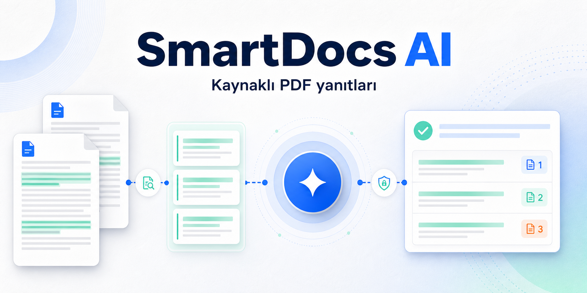
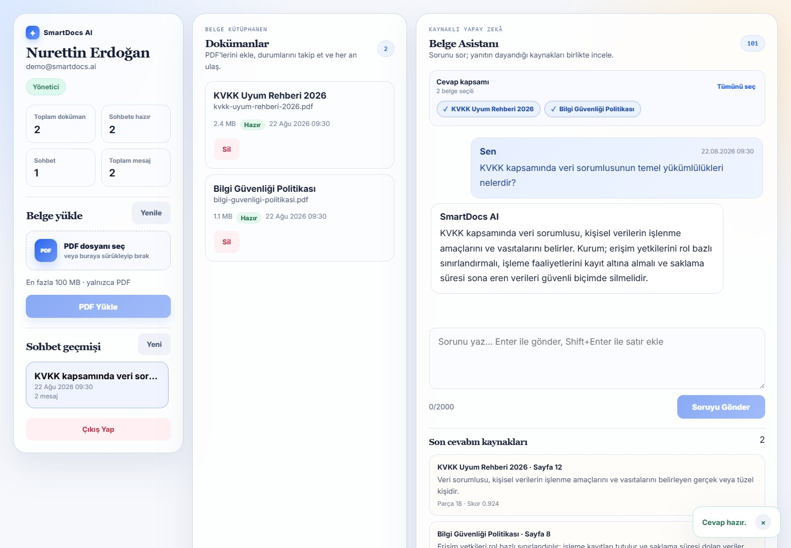

# SmartDocs AI

<p align="center">
  
</p>

<p align="center">
  <a href="https://github.com/Nurettin-Erdogan/smartdocs-ai/actions/workflows/ci.yml"></a>
  <a href="https://github.com/Nurettin-Erdogan/smartdocs-ai/actions/workflows/codeql.yml"></a>
  <a href="LICENSE"></a>
</p>

SmartDocs AI, kullanıcının kendi PDF belgeleri üzerinde kaynak göstererek Türkçe soru-cevap yapmasını sağlayan, yerel çalışabilen bir RAG uygulamasıdır.

<p align="center">
  <a href="https://smartdocs-ai-henna.vercel.app"><strong>Canlı vitrin demosu →</strong></a>
  &nbsp;·&nbsp;
  <a href="#docker-ile-hızlı-başlangıç"><strong>Yerelde çalıştır →</strong></a>
  &nbsp;·&nbsp;
  <a href="docs/demo-guide.md"><strong>3 dakikalık demo</strong></a>
  &nbsp;·&nbsp;
  <a href="docs/system-architecture.md">Mimari</a>
  &nbsp;·&nbsp;
  <a href="#test-ve-doğrulama">Testler</a>
  &nbsp;·&nbsp;
  <a href="CONTRIBUTING.md">Katkı rehberi</a>
</p>

<p align="center">
  
</p>
<p align="center"><sub>Canlı vitrin, PDF’yi tarayıcıda işler ve ilgili metin parçalarından yapay zekâ destekli, kaynaklı cevap üretir.</sub></p>

## Portföy özeti

| | |
| --- | --- |
| **Problem** | Özel PDF belgelerinde arama yapmak isteyen ekiplerin veriyi üçüncü taraf bir yapay zekâ servisine göndermek zorunda kalması |
| **Çözüm** | Ollama, Qdrant ve PostgreSQL kullanan; cevaplarını sayfa ve parça düzeyinde kaynaklandıran yerel RAG sistemi |
| **Zor mühendislik kararları** | Kullanıcı bazlı vektör filtreleme, başarısız işlemde eski indeksi koruyan güvenli yeniden indeksleme ve dosya yükleme savunmaları |
| **Doğrulama** | GitHub Actions, CodeQL, otomatik backend/frontend testleri ve Docker Compose ile tekrarlanabilir tam yığın kurulum |

Bu proje; RAG akışını bir demo çağrısından çıkarıp kimlik doğrulama, sahiplik sınırları, kalıcı veri, hata durumları ve kaynak gösterimi olan gerçek bir ürüne dönüştürebildiğimi gösterir.

Repository ayrıca ağır Ollama/Qdrant altyapısı olmadan çalışan bir **Vercel vitrin modu**
içerir. Canlı sürümde yüklenen PDF, PDF.js ile doğrudan tarayıcıda okunur ve
sayfalara göre parçalanır. PDF dosyasının kendisi sunucuya yüklenmez; soruyla ilgili
metin parçaları, sunucu tarafındaki anahtar ile Google Gemini API'ye gönderilerek
Türkçe ve kaynaklı cevap üretilir. Yapay zekâ servisi kullanılamazsa kaynaklara dayalı
yerel cevap motoru otomatik olarak devreye girer. Sayfa yenilendiğinde yerel oturum temizlenir.

Tüm belge içeriğinin ve modelin makinede kalması gereken senaryolarda Docker ile çalışan
Ollama + Qdrant kurulumu kullanılmalıdır.

Canlı demo: <https://smartdocs-ai-henna.vercel.app>

```text
Canlı vitrin: PDF → tarayıcıda metin çıkarma → ilgili parçaları seçme
             → Vercel Function → Google Gemini API → kaynaklı cevap

Tam kurulum:
PDF → metin çıkarma → parçalara ayırma → Ollama embedding
    → Qdrant anlamsal arama → Ollama cevap üretimi → kaynaklı cevap
```

## Öne çıkanlar

- React 19 + TypeScript ile duyarlı web arayüzü
- ASP.NET Core 10 API ve PostgreSQL kalıcı veri katmanı
- PdfPig ile PDF metni çıkarma ve örtüşmeli parçalara ayırma
- Ollama `/api/embed` ve `/api/generate` entegrasyonu
- Qdrant Query API ile kullanıcıya ait belgelerde filtreli arama
- Belge, sayfa, parça ve benzerlik skoru içeren kaynak gösterimi
- Kaynak kartından ilgili PDF sayfasına açılan, metni vurgulayan güvenli önizleme
- Tam sohbet geçmişi, yeni sohbet ve oturum süresi yönetimi
- Başarısız indekslemeyi tekrar deneme ve durum takibi
- Yeni vektörleri önce yazarak eski indeksi koruyan güvenli yeniden indeksleme
- JWT doğrulama, sahiplik kontrolleri ve endpoint bazlı hız sınırlama
- 100 MB sınırı, PDF imza kontrolü, güvenli fiziksel dosya adı ve işlem sınırları
- Docker Compose, çok aşamalı üretim imajı ve GitHub Actions CI
- Backend ve frontend için otomatik test kapsamı

## Mimari

| Katman | Teknoloji | Sorumluluk |
| --- | --- | --- |
| Arayüz | React, TypeScript, Vite | Kimlik doğrulama, belge ve sohbet deneyimi |
| API | ASP.NET Core 10 | Yetkilendirme, PDF akışı, RAG orkestrasyonu |
| İlişkisel veri | PostgreSQL, EF Core | Kullanıcı, belge, parça ve sohbet kayıtları |
| Vektör arama | Qdrant | Embedding saklama ve benzerlik araması |
| Yerel yapay zekâ | Ollama | Embedding ve Türkçe cevap üretimi |

Ayrıntılı akış için [sistem mimarisi](docs/system-architecture.md) belgesine bakın.

## Docker ile hızlı başlangıç

Gereksinim: Docker Desktop. Ollama ve gerekli modeller uygulamayla birlikte Docker içinde hazırlanır; ayrıca Ollama kurmanız gerekmez.

Windows'ta en kolay kurulum için `start-smartdocs.cmd` dosyasına çift tıklayın. Betik güvenli veritabanı/JWT anahtarlarını otomatik üretir, tüm servisleri ve modelleri hazırlar, bağımlılıkları denetler ve uygulamayı tarayıcıda açar.

PowerShell üzerinden aynı işlem:

```powershell
.\start-smartdocs.ps1 -TarayiciyiAc
```

Elle kurulum yapmak isterseniz proje kökünde:

```powershell
Copy-Item .env.example .env
```

`.env` içindeki şu değerleri mutlaka doldurun:

- `POSTGRES_PASSWORD`: güçlü bir PostgreSQL parolası
- `JWT_TOKEN_KEY`: en az 64 baytlık rastgele bir anahtar

Windows PowerShell ile uygun JWT anahtarı üretme örneği:

```powershell
$bytes = New-Object byte[] 64
[Security.Cryptography.RandomNumberGenerator]::Create().GetBytes($bytes)
[Convert]::ToBase64String($bytes)
```

Servisleri başlatın:

```powershell
docker compose up --build
docker compose exec ollama ollama pull nomic-embed-text
docker compose exec ollama ollama pull qwen2.5:3b
```

Uygulama varsayılan olarak `http://localhost:8080` adresinde açılır. İlk kullanıcıyı arayüzdeki **Kayıt Ol** sekmesinden oluşturabilirsiniz.

İlk model indirmesi birkaç dakika sürebilir; sonraki açılışlarda modeller kalıcı Docker hacminden kullanılır.

## Yerel geliştirme

Gereksinimler:

- .NET 10 SDK
- Node.js 24 (Node 20 de mevcut frontend için uygundur)
- PostgreSQL 17+
- Qdrant 1.18+
- Ollama ve `nomic-embed-text`, `qwen2.5:3b` modelleri

Backend gizli ayarlarını kaynak koda yazmadan tanımlayın:

```powershell
dotnet user-secrets set "ConnectionStrings:DefaultConnection" "Host=localhost;Port=5432;Database=SmartDocsAI_Db;Username=postgres;Password=PAROLA" --project backend\SmartDocsAI.API
dotnet user-secrets set "JwtSettings:TokenKey" "EN_AZ_64_BAYT_RASTGELE_ANAHTAR" --project backend\SmartDocsAI.API
dotnet user-secrets set "SeedData:AdminPassword" "GELISTIRME_ADMIN_PAROLASI" --project backend\SmartDocsAI.API
```

Backend:

```powershell
dotnet run --project backend\SmartDocsAI.API
```

Development ortamında migration'lar otomatik uygulanır. Veritabanında kullanıcı yoksa `SeedData:AdminPassword` ile `admin@smartdocs.ai` hesabı oluşturulur.

Frontend:

```powershell
Set-Location frontend
npm ci
npm run dev
```

Yalnızca portföy arayüzünü örnek verilerle çalıştırmak için:

```powershell
Set-Location frontend
npm run build:demo
npm run preview
```

Vite `http://localhost:5173` adresinde çalışır ve `/api` isteklerini `http://localhost:5129` adresine yönlendirir.

## Test ve doğrulama

Depo; backend ve frontend testlerini, TypeScript tip kontrolünü, üretim derlemesini ve Docker imajı paketlemesini CI üzerinde ayrı kalite kapıları olarak çalıştırır. CodeQL ayrıca C# ve JavaScript/TypeScript kaynaklarını tarar.

```powershell
dotnet test tests\SmartDocsAI.API.Tests\SmartDocsAI.API.Tests.csproj --configuration Release

Set-Location frontend
npm ci
npm run typecheck
npm test
npm run build
```

CI aynı kontrolleri çalıştırır ve son aşamada üretim Docker imajını derler.

## Temel API

| Metot | Yol | Açıklama |
| --- | --- | --- |
| `POST` | `/api/auth/register` | Hesap oluşturur ve JWT döndürür |
| `POST` | `/api/auth/login` | Oturum açar ve JWT döndürür |
| `GET` | `/api/documents` | Kullanıcının belgelerini listeler |
| `GET` | `/api/documents/{id}/file` | Kullanıcıya ait PDF'yi önizleme için aktarır |
| `POST` | `/api/documents/upload` | PDF'yi kabul eder ve arka plan kuyruğuna alır |
| `DELETE` | `/api/documents/{id}` | Belgeyi ve vektörlerini siler |
| `POST` | `/api/documents/{id}/reindex` | Belgeyi yeniden indeksler |
| `POST` | `/api/chat` | Kaynaklı cevap üretir |
| `GET` | `/api/chat/history` | Son 50 sohbetin özetini getirir |
| `GET` | `/api/chat/{conversationId}` | Bir sohbetin tüm mesajlarını getirir |
| `GET` | `/api/home` | Basit canlılık yanıtı verir |

Korumalı endpointlerde `Authorization: Bearer <token>` başlığı gerekir. İstek/yanıt örnekleri ve durum kodları [API belgesinde](docs/api.md) bulunur.

## Belge durumları

- `Pending`: belge işleme sırasında bekliyor
- `Extracting`: PDF metni çıkarılıyor
- `Indexing`: yapay zekâ arama indeksi hazırlanıyor
- `RetryWaiting`: geçici hata sonrası otomatik yeniden deneme bekleniyor
- `Ready`: sohbet aramasına hazır
- `Failed`: dış servis veya indeksleme hatası oluştu; tekrar denenebilir
- `NoContent`: PDF'den kullanılabilir metin çıkarılamadı
- `Deleting`: Qdrant, dosya ve veritabanı temizliği tamamlanana kadar kalıcı silme kuyruğunda

Sohbet yalnızca `Ready` belgeleri arar. Her kullanıcı sadece kendi belge ve sohbetlerine erişebilir.

## Yapılandırma

| Anahtar | Varsayılan | Açıklama |
| --- | --- | --- |
| `JwtSettings:LifetimeMinutes` | `480` | JWT ömrü |
| `OllamaSettings:TimeoutSeconds` | `0` | Ollama HTTP zaman aşımı; `0` sınırsız bekler |
| `OllamaSettings:WarmupTimeoutSeconds` | `30` | Ollama kapalıysa API başlangıcının takılmasını önleyen model ısıtma bütçesi |
| `OllamaSettings:KeepAlive` | `-1` | Sohbet modelini hızlı yanıt için bellekte tutma süresi; `-1` sürekli tutar |
| `QdrantSettings:VectorSize` | `768` | Embedding boyutu; modelle aynı olmalı |
| `QdrantSettings:UpsertBatchSize` | `64` | Vektör yazma paket boyutu |
| `RagSettings:SearchLimit` | `4` | Cevap bağlamına alınan parça sayısı |
| `RagSettings:MinimumScore` | `0.35` | En düşük benzerlik skoru |
| `DocumentProcessingSettings:MaxChunks` | `2000` | Tek PDF için güvenli parça sınırı |
| `DocumentProcessingSettings:MaxPages` | `500` | Tek PDF için sayfa sınırı |
| `DocumentProcessingSettings:MaxExtractedCharacters` | `2000000` | Açılmış PDF metni için karakter bütçesi |
| `DocumentProcessingSettings:TimeoutSeconds` | `60` | PDF ayrıştırma zaman bütçesi |
| `DocumentProcessingSettings:MaxConcurrentDocuments` | `2` | Aynı anda ayrıştırılabilecek PDF sayısı |
| `DocumentDeletionSettings:RetryIntervalSeconds` | `30` | Bekleyen kalıcı silmeleri yeniden deneme aralığı |
| `ProxySettings:KnownProxies` | `[]` | `X-Forwarded-*` başlıklarına güvenilecek proxy IP'leri |
| `Hosting:UseHttpsRedirection` | `true` | Doğrudan barındırmada HTTPS yönlendirmesi |

ASP.NET ortam değişkenlerinde `:` yerine `__` kullanılır; örneğin `RagSettings__MinimumScore`.

## Proje yapısı

```text
backend/SmartDocsAI.API/       ASP.NET Core API
frontend/                      React arayüzü ve Vitest testleri
tests/SmartDocsAI.API.Tests/   xUnit servis testleri
database/                      PostgreSQL migration betiği ve arşiv
docs/                          Mimari, API, veritabanı ve dağıtım belgeleri
.github/workflows/ci.yml       CI iş akışı
Dockerfile                     Üretim imajı
docker-compose.yml             Uygulama servisleri
```

## Üretim notları

- `.env`, JWT anahtarı ve parolaları Git'e eklemeyin.
- Uygulamayı TLS sonlandıran bir reverse proxy arkasında çalıştırın.
- PostgreSQL, Qdrant ve `Uploads` volume'larını düzenli yedekleyin.
- Qdrant koleksiyonunun vektör boyutunu embedding modeli değiştiğinde birlikte güncelleyin ve belgeleri yeniden indeksleyin.
- Ölçekli kurulumda tek süreç içi yeniden indeksleme kilidi yerine dağıtık iş kuyruğu kullanın.

Dağıtım ayrıntıları için [deployment.md](docs/deployment.md), şema ayrıntıları için [database.md](docs/database.md) dosyasına bakın.

## Lisans

Bu proje [MIT Lisansı](LICENSE) ile lisanslanmıştır.
